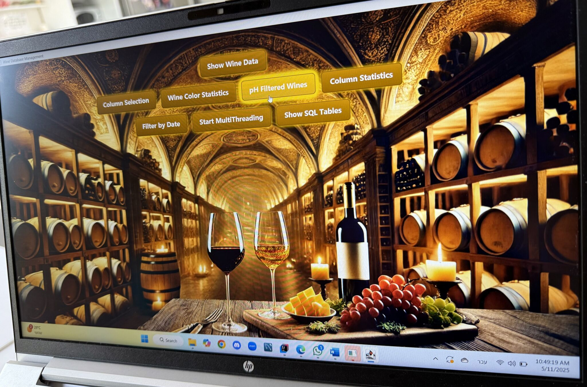

🍷 Wine Java SQL Project
Wine Management and Recommendation System built with **JavaFX**, **Java**, **MySQL**, and **Maven**.  
This application allows users to browse, search, and analyze wine data using chemical properties, quality scores, and other attributes.  
It includes advanced filtering, statistics, visualizations, and multi-threaded execution for enhanced performance.

📖 Project Overview
This project was developed as part of the "System Programming Introduction" course at "*Kinneret Academic College".  
It provides an interactive graphical interface for wine data analysis, integrating SQL queries, JavaFX UI, and a relational database.  
The main goal was to create a complete software system that connects to a relational database (MySQL), retrieves and processes wine data, and displays it in an intuitive and visually appealing interface.

✨ Features
- Browse Wine Catalog from database  
- Search & Filter wines by:
- Color (Red / White)
- Quality score
- pH values
- Date ranges  
- Statistical Analysis – Minimum/Maximum values per chosen field  
- Visualization – Pie charts, histograms, and dashboards using JavaFX chart libraries  
- Multi-threading – Run two SQL queries in parallel and display results side-by-side  
- Admin Functions – Select specific columns to display, create new tables from query results  
- Custom UI Styling – Modern design with CSS animations and background images

🛠Technologies Used
- Java 17 – Main programming language  
- JavaFX – Graphical user interface (FXML + Scene Builder)  
- MySQL – Relational database to store and retrieve wine data  
- JDBC – Java Database Connectivity for communication with MySQL  
- Maven – Dependency management and project build  
- Multi-threading – Concurrent query execution for improved performance  
- CSS – Custom styling for the interface  

📊 Example Queries Implemented
- Display all wines from the database.
- Filter wines by selected columns.
- Count red, white, and total wines.
- Show wines with pH < 6 along with selected fields.
- Find min/max value for a numeric field.
- Filter wines between two given dates.
- Create new tables based on query results.

👩‍💻 Authors
- Lozan Amer – Software Engineering Student, Kinneret Academic College  
- Fdl Abo Shaheen – Software Engineering Student, Kinneret Academic College  

📜 License
This project is for educational purposes only.

## Screenshot

